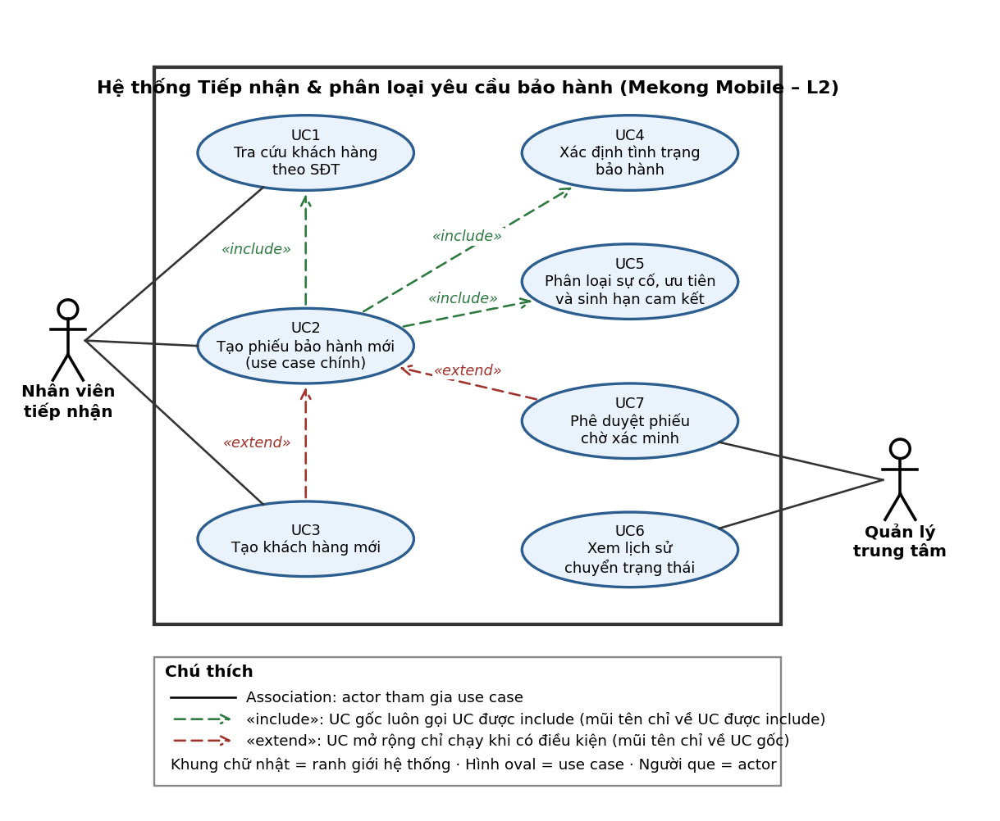

# Bản đặc tả yêu cầu rút gọn (SRS)

**Luồng L2: Tiếp nhận và phân loại yêu cầu bảo hành**

## 1. Giới thiệu và phạm vi

- Bối cảnh: Mekong Mobile hiện ghi nhận yêu cầu bảo hành trên phiếu giấy, không quản lý được trạng thái, tiến độ xử lý và hạn cam kết (vấn đề V2, V8).

- Phạm vi chọn: Quản lý tiếp nhận và phân loại yêu cầu bảo hành. Nhân viên tiếp nhận tra cứu khách hàng, ghi nhận thiết bị và mô tả lỗi; hệ thống tự động xác định tình trạng bảo hành, phân loại nhóm sự cố, sinh hạn cam kết và theo dõi lịch sử trạng thái.

- Chủ ý KHÔNG làm (WON'T): phân công kỹ thuật viên (L4), quản lý kho linh kiện (L5), báo cáo tổng hợp đa chiều cấp công ty (L6); chuyển trạng thái xử lý và đóng phiếu (hệ thống chỉ ghi nhận và hiển thị lịch sử trạng thái từ lúc tạo phiếu).

**Bảng thuật ngữ:**

| **Thuật ngữ**       | **Định nghĩa**                               | **Tên kỹ thuật**            |
|---------------------|----------------------------------------------|-----------------------------|
| Khách hàng          | Cá nhân đã mua SP/DV của Mekong Mobile       | customer                    |
| Thiết bị            | Một máy cụ thể khách sở hữu (serial/IMEI)    | device                      |
| Phiếu bảo hành      | Yêu cầu bảo hành được ghi nhận               | ticket                      |
| Trạng thái phiếu    | Vị trí trong vòng đời: MOI, DANG_XU_LY...    | ticket_status_log.to_status |
| Hạn cam kết         | Thời điểm chậm nhất phải hoàn tất phiếu      | due_date                    |
| Nhóm sự cố          | Phân loại nguyên nhân: màn hình, pin, sạc... | issue_category              |
| Mức ưu tiên         | Mức khẩn: CAO / TRUNG_BINH / THAP            | priority                    |
| Tình trạng bảo hành | Thiết bị còn hay hết hạn bảo hành            | is_warranty                 |

## 2. Các bên liên quan và vai trò

| **Vai trò**         | **Được làm**                                           | **Không được làm**                       |
|---------------------|--------------------------------------------------------|------------------------------------------|
| Nhân viên tiếp nhận | Tra cứu khách, tạo phiếu, phân loại, xem phiếu đã tạo  | Không xem dữ liệu trung tâm khác (QT-14) |
| Quản lý trung tâm   | Phê duyệt phiếu, xem lịch sử trạng thái toàn trung tâm | Không sửa trực tiếp lịch sử log (QT-13)  |

## 3. Yêu cầu chức năng

| **Mã** | **Yêu cầu chức năng**                                                 | **User Story** | **MoSCoW** |
|--------|-----------------------------------------------------------------------|----------------|------------|
| FR1    | Tra cứu khách hàng theo SĐT và tự điền thông tin.                     | US1            | SHOULD     |
| FR2    | Tạo khách hàng mới khi SĐT chưa tồn tại.                              | US2            | SHOULD     |
| FR3    | Tạo phiếu bảo hành mới với thông tin bắt buộc.                        | US3            | MUST       |
| FR4    | Tự động xác định tình trạng bảo hành của thiết bị.                    | US4            | MUST       |
| FR5    | Đề xuất nhóm sự cố và mức ưu tiên theo mô tả lỗi.                     | US5            | SHOULD     |
| FR6    | Tự động sinh hạn cam kết xử lý theo mức ưu tiên.                      | US6            | MUST       |
| FR7    | Ghi lại và hiển thị lịch sử chuyển trạng thái phiếu.                  | US7            | SHOULD     |
| FR8    | Cảnh báo khi SĐT đã tồn tại nhưng tên khách hàng nhập vào không khớp. | US8            | COULD      |

## Danh sách User Story và Tiêu chí chấp nhận (AC)

**US1 (SHOULD): Là nhân viên tiếp nhận, tôi muốn tra cứu khách hàng theo SĐT để không phải nhập lại thông tin đã có.**

- AC1: GIVEN SĐT đã có, WHEN nhập tìm, THEN tự điền tên, địa chỉ, danh sách thiết bị.

- AC2: GIVEN SĐT chưa có, WHEN nhập tìm, THEN báo không thấy và đề nghị tạo mới.

**US2 (SHOULD): Là nhân viên tiếp nhận, tôi muốn tạo khách hàng mới khi SĐT chưa tồn tại để vẫn ghi nhận được yêu cầu của khách lần đầu đến trung tâm.**

- AC1: GIVEN SĐT chưa có, WHEN nhập đủ tên và Lưu, THEN tạo mới thành công.

- AC2: GIVEN SĐT có khoảng trắng, WHEN lưu, THEN tự động chuẩn hóa về dạng 0xxxxxxxxx.

**US3 (MUST): Là nhân viên tiếp nhận, tôi muốn tạo phiếu bảo hành mới để mọi yêu cầu của khách được ghi nhận chính thức và theo dõi được tiến độ xử lý.**

- AC1: GIVEN đã chọn khách & thiết bị, WHEN nhập mô tả lỗi và Lưu, THEN tạo phiếu MOI.

- AC2: GIVEN chưa nhập mô tả lỗi, WHEN Lưu, THEN từ chối và báo lỗi, giữ nguyên dữ liệu.

**US4 (MUST): Là nhân viên tiếp nhận, tôi muốn hệ thống tự xác định bảo hành để biết ngay thiết bị còn hay hết bảo hành mà không phải tra giấy tờ thủ công.**

- AC1: GIVEN thiết bị đủ điều kiện ngày mua, WHEN tạo phiếu, THEN đánh dấu is_warranty = true.

- AC2: GIVEN thiết bị thiếu ngày mua, WHEN tạo phiếu, THEN chuyển trạng thái chờ phê duyệt.

**US5 (SHOULD): Là nhân viên tiếp nhận, tôi muốn hệ thống tự phân loại nhóm sự cố để phiếu được gán đúng nhóm và mức ưu tiên, giảm sai sót khi phân loại bằng tay.**

- AC1: GIVEN mô tả chứa từ khóa "sạc", WHEN phân loại, THEN chọn nhóm SAC.

- AC2: GIVEN mô tả chung chung, WHEN phân loại, THEN chọn nhóm KHAC và cho phép sửa thủ công.

**US6 (MUST): Là nhân viên tiếp nhận, tôi muốn sinh hạn cam kết tự động để mỗi phiếu có thời hạn xử lý rõ ràng và trung tâm giữ đúng cam kết với khách.**

- AC1: GIVEN phiếu CAO, WHEN tạo sáng Thứ Ba, THEN hạn là sáng Thứ Tư (24h).

- AC2: GIVEN phiếu THAP tạo chiều Thứ Bảy, WHEN tính hạn, THEN không tính Chủ Nhật.

**US7 (SHOULD): Là quản lý trung tâm, tôi muốn xem lịch sử chuyển trạng thái của phiếu để kiểm soát tiến độ và truy vết khi có khiếu nại.**

**US8 (COULD): Là nhân viên tiếp nhận, tôi muốn được cảnh báo khi SĐT có nhưng sai tên khách hàng để tránh gắn nhầm phiếu cho khách khác.**

## 4. Yêu cầu phi chức năng

| **Mã** | **Yêu cầu phi chức năng (có ngưỡng)**                                                                                                             | **Loại NFR** |
|--------|---------------------------------------------------------------------------------------------------------------------------------------------------|--------------|
| NFR1   | Tra cứu khách hàng theo SĐT trả kết quả dưới 1 giây (500 bản ghi).                                                                                | Hiệu năng    |
| NFR2   | Với 100% màn hình và phản hồi API dành cho vai trò khác Quản lý, SĐT phải che 4 chữ số giữa (dạng 090\*\*\*\*567); chỉ Quản lý thấy đủ 10 chữ số. | Bảo mật      |
| NFR3   | Nhân viên mới tạo phiếu đúng trong dưới 3 phút (không cần hỗ trợ).                                                                                | Khả dụng     |

## 5. Ràng buộc và quy tắc nghiệp vụ

- QT-01: Số điện thoại khách hàng là duy nhất.

- QT-02: SĐT chuẩn hóa về 10 chữ số bắt đầu bằng 0.

- QT-03: Thiết bị xác định duy nhất bằng serial; 1 thiết bị thuộc 1 khách.

- QT-04: Hạn cam kết: CAO=24h, TRUNG_BINH=72h, THAP=120h (tính T2–T7).

- QT-05: Còn bảo hành nếu (ngày tiếp nhận − ngày mua) ≤ số tháng bảo hành.

- QT-06: Phiếu chuyển trạng thái đúng vòng đời, không lùi trạng thái.

- QT-13: Lịch sử chuyển trạng thái chỉ được ghi thêm, không ai được sửa trực tiếp.

- QT-14: Mỗi người dùng chỉ truy cập dữ liệu của trung tâm mình.

## 6. Bảng truy vết yêu cầu

| **FR** | **User Story** | **Use Case** | **MoSCoW** | **Test case (BT3)** |
|--------|----------------|--------------|------------|---------------------|
| FR1    | US1            | UC1          | SHOULD     | TC01, TC02          |
| FR2    | US2            | UC3          | SHOULD     | TC03                |
| FR3    | US3            | UC2          | MUST       | TC04, TC05          |
| FR4    | US4            | UC4, UC7     | MUST       | TC06, TC07          |
| FR5    | US5            | UC5          | SHOULD     | TC08                |
| FR6    | US6            | UC5          | MUST       | TC09                |
| FR7    | US7            | UC6          | SHOULD     | TC10                |
| FR8    | US8            | UC1          | COULD      | Chưa có             |

## Use Case Diagram

*Hình 1 — Use Case Diagram luồng L2 (2 actor, 7 use case, có ranh giới hệ thống và chú thích). File gốc: docs/diagrams/usecase.drawio.*

## Đặc tả Use Case chi tiết: UC2 — Tạo phiếu bảo hành mới

Actor chính: Nhân viên tiếp nhận · Liên quan: US1, US3, US4, US5, US6 · Mức: MUST

Điều kiện trước: Đã đăng nhập và có quyền tại trung tâm.

Điều kiện sau: Một phiếu được lưu, có mã: ở trạng thái MOI kèm hạn cam kết (luồng chính) hoặc CHO_PHE_DUYET nếu thiếu ngày mua (luồng 5a).

**Luồng chính:**

1.  Chọn chức năng "Tạo phiếu bảo hành mới".

2.  Nhập số điện thoại khách hàng.

3.  Hệ thống tra cứu thông tin và danh sách thiết bị. \[include UC1\]

4.  Chọn thiết bị hoặc nhập mới.

5.  Hệ thống xác định tình trạng bảo hành. \[include UC4\]

6.  Nhập mô tả lỗi.

7.  Hệ thống đề xuất nhóm sự cố, ưu tiên và hạn cam kết. \[include UC5\]

8.  Xác nhận và bấm Lưu.

9.  Hệ thống sinh mã phiếu, lưu trạng thái MOI.

**Luồng ngoại lệ:**

- 3a. Khách chưa tồn tại → Mở form tạo khách mới. \[extend UC3\]

- 5a. Không có ngày mua → Đánh dấu chờ xác minh, gửi Quản lý. \[extend UC7\]

- 8a. Thiếu mô tả lỗi → Từ chối lưu, báo lỗi, không mất dữ liệu.
